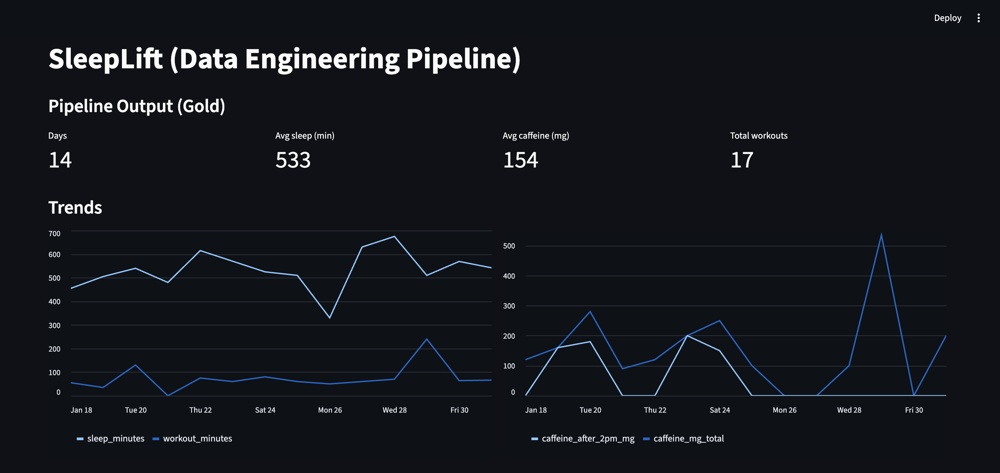
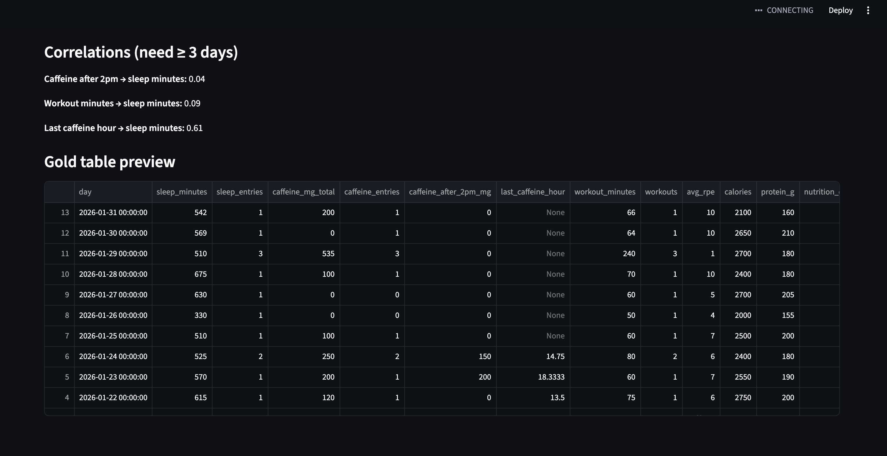
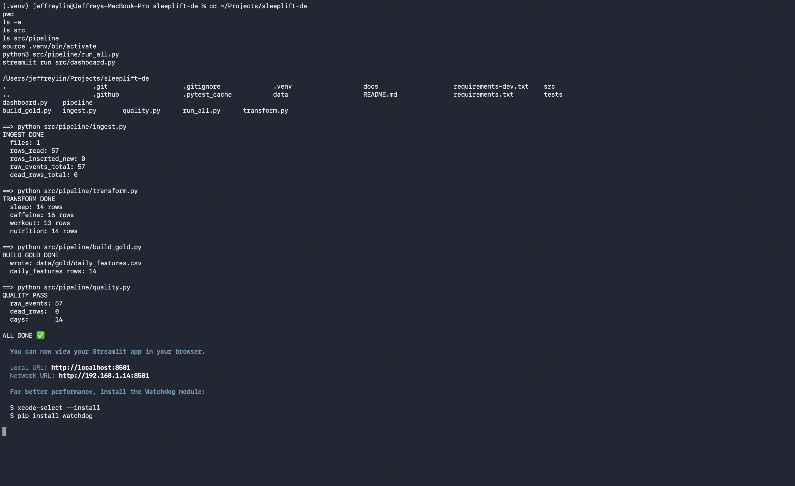
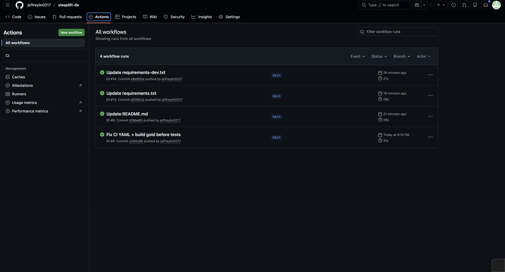

[](https://github.com/jeffreylin0217/sleeplift-de/actions/workflows/ci.yml)

# SleepLift-DE

SleepLift-DE is a student-built batch ELT analytics pipeline for personal sleep, caffeine, workout, and nutrition logs. It loads CSV exports into DuckDB, organizes records into Bronze, Silver, and Gold layers, validates the outputs, and produces a `daily_features` table for a Streamlit dashboard.

This project is intentionally local and explainable. It is not meant to be a production health app; it is meant to show data ingestion, data modeling, data-quality checks, testing, and dashboarding on a realistic small dataset.

## What the project does

```text
raw CSV exports
    ↓
Bronze: raw_events
    ↓
Silver: typed sleep / caffeine / workout / nutrition tables
    ↓
Gold: daily_features, one row per day
    ↓
Streamlit dashboard
```

## Key features

- Ingests 4 CSV event streams: `sleep.csv`, `caffeine.csv`, `workout.csv`, and `nutrition.csv`
- Stores raw records in DuckDB with deterministic SHA-256 `event_id` values to avoid duplicate inserts on reruns
- Builds typed Silver tables for sleep, caffeine, workout, and nutrition records
- Builds a Gold `daily_features` table with one row per day for dashboarding and analysis
- Runs data-quality checks for duplicate records, invalid values, and malformed rows
- Sends malformed records to `dead_rows` instead of mixing them into clean analytics tables
- Includes pytest checks for Gold-layer invariants and malformed-input quarantine behavior, executed through GitHub Actions CI

## Skills demonstrated

- Python-based data pipeline development
- SQL-style data modeling with DuckDB
- Bronze/Silver/Gold analytics architecture
- Data cleaning, validation, and quality checks
- Idempotent ingestion using deterministic event IDs
- Dashboarding with Streamlit
- Automated testing with pytest and GitHub Actions

## Quick start

```bash
python3 -m venv .venv
source .venv/bin/activate
pip install -r requirements.txt
pip install -r requirements-dev.txt

# optional: copy demo inputs into the raw input folder
cp data/raw/sample/*.csv data/raw/

python3 src/pipeline/run_all.py
pytest -q
streamlit run src/dashboard.py
```

## Input format

The demo data uses one simple CSV per log type:

```text
data/raw/sleep.csv
data/raw/caffeine.csv
data/raw/workout.csv
data/raw/nutrition.csv
```

The pipeline also supports the older unified export format used during early development:

```text
./data/raw/demo_events.csv
```

Do not commit real personal health data. Use the fake sample files in `data/raw/sample/` for demos, CI, and sharing.

## Main tables

- `raw_events`: Bronze table with one row per raw event and a deterministic `event_id`
- `dead_rows`: malformed rows that should not enter the clean tables
- `sleep`, `caffeine`, `workout`, `nutrition`: typed Silver tables
- `daily_features`: Gold feature mart with one row per day

## Screenshots

### Dashboard



### Gold table preview



### Pipeline run



### CI passing



## Repository layout

```text
src/pipeline/ingest.py       # load CSVs into raw_events
src/pipeline/transform.py    # build typed Silver tables
src/pipeline/build_gold.py   # build daily_features and export CSV
src/pipeline/quality.py      # validate core outputs
tests/test_gold_invariants.py
tests/test_quarantine.py
src/dashboard.py
docs/data_dictionary.md
docs/sql_examples.md
```

## Related project

This pipeline can be used with SleepLift Data Logger, an offline SwiftUI app that logs sleep, caffeine, workout, and nutrition records as structured local data and exports them as CSV files for downstream analytics.

- SleepLift Data Logger: https://github.com/jeffreylin0217/sleeplift-ios

## How to explain it simply

I built SleepLift-DE to practice data engineering with a realistic personal dataset. The project takes exported CSV logs, assigns each record a deterministic event ID so reruns do not create duplicates, loads the raw events into DuckDB, transforms them into typed tables, and builds a daily `daily_features` table. The Streamlit dashboard then uses that Gold table to show sleep, caffeine, workout, and nutrition trends.
